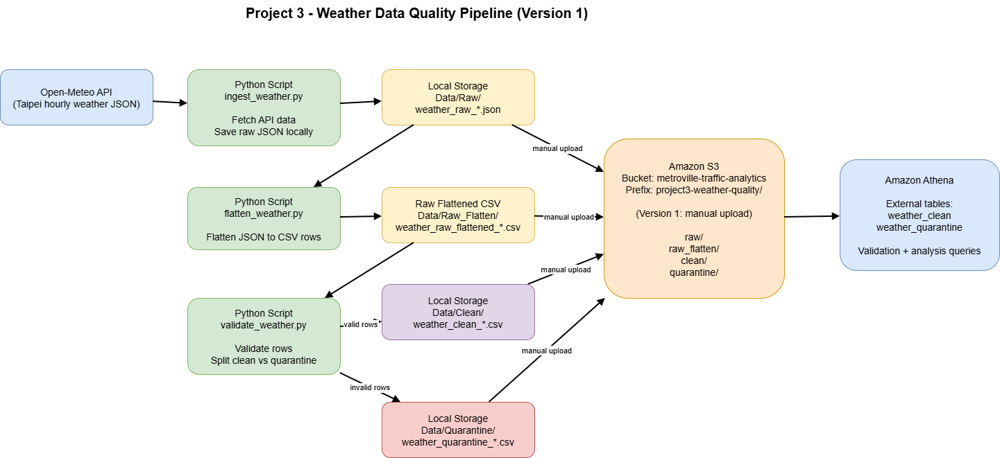
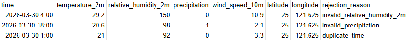
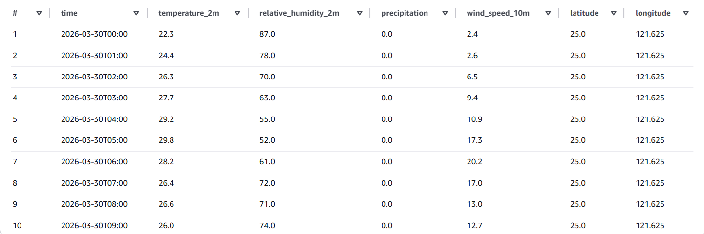
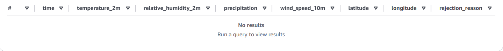
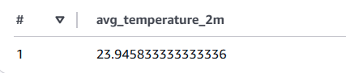
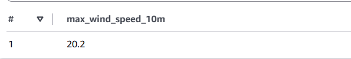
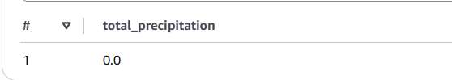

# 🌦️ Weather Data Quality Pipeline (AWS)

## 📌 Overview

This project builds an end-to-end batch data quality pipeline using Python, Amazon S3, and Amazon Athena.

Hourly weather data is pulled from the Open-Meteo API, saved as raw JSON, flattened into CSV format, validated with Python, split into clean and quarantine datasets, uploaded manually to Amazon S3, and queried in Athena for verification and simple analysis.

The goal is to demonstrate a complete Version 1 batch pipeline that clearly separates raw, clean, and rejected data and makes the final outputs queryable in AWS.

---

## 🎯 Project Goal

Build a portfolio-ready data quality pipeline that:

- ingests real weather API data
- preserves the raw source data
- flattens nested JSON into row-based records
- validates records using simple business rules
- separates valid and invalid data
- stores final outputs in Amazon S3
- queries clean and quarantine datasets in Athena

---

## 🏗️ Architecture

---

## ☁️ Why AWS?

Amazon S3 and Athena were used to simulate a simple cloud-based analytics workflow.

This setup makes it possible to:

- store pipeline outputs in a structured data lake layout
- separate raw, flattened, clean, and quarantine datasets
- query validated data without managing infrastructure
- verify that the final outputs are usable for downstream analytics

Version 1 uses manual upload to S3 and manual Athena queries to keep the scope focused and beginner-friendly.

---

## 🌐 Dataset

**Source:** Open-Meteo Forecast API  
**Location:** Taipei  
**Granularity:** Hourly weather data

### Fields used

- `time`
- `temperature_2m`
- `relative_humidity_2m`
- `precipitation`
- `wind_speed_10m`
- `latitude`
- `longitude`

### Why this dataset?

This dataset was chosen because it is:

- public and easy to access
- JSON-based
- realistic operational/environmental data
- suitable for repeated ingestion
- easy to validate with simple numeric rules
- a good fit for S3 + Athena

---

## 🧱 Pipeline Flow

### 1. Ingestion

A Python script calls the Open-Meteo API and saves the raw response as a JSON file.

**Output:**  
`Data/Raw/weather_raw_*.json`

### 2. Flattening

A second Python script converts the hourly JSON arrays into row-based CSV records.

**Output:**  
`Data/Raw_Flatten/weather_raw_flattened_*.csv`

### 3. Validation and split

A validation script checks each row and separates the data into:

- clean records
- quarantine records

**Outputs:**

- `Data/Clean/weather_clean_*.csv`
- `Data/Quarantine/weather_quarantine_*.csv`

### 4. Manual AWS upload

Final local outputs were uploaded manually to the existing S3 bucket:

- `s3://metroville-traffic-analytics/project3-weather-quality/raw/`
- `s3://metroville-traffic-analytics/project3-weather-quality/raw_flatten/`
- `s3://metroville-traffic-analytics/project3-weather-quality/clean/`
- `s3://metroville-traffic-analytics/project3-weather-quality/quarantine/`

### 5. Athena querying

Athena external tables were created over:

- `weather_clean`
- `weather_quarantine`

These tables were used for:

- data quality verification
- simple analysis

---

## ✅ Validation Rules

### Required fields

- `time`
- `temperature_2m`
- `relative_humidity_2m`
- `precipitation`
- `wind_speed_10m`
- `latitude`
- `longitude`

### Validation checks

1. Required fields must not be empty
2. `temperature_2m` must be between `-50` and `60`
3. `relative_humidity_2m` must be between `0` and `100`
4. `precipitation` must be `>= 0`
5. `wind_speed_10m` must be `>= 0`
6. `time` must be unique within a file

### Output rule

- valid rows → Clean
- invalid rows → Quarantine
- duplicates → Quarantine
- quarantined rows include a `rejection_reason`

---

## 🧪 Bad Data Proof Test

A controlled test was created to confirm that invalid data is correctly rejected.

### Injected issues

- invalid humidity
- invalid precipitation
- duplicate timestamp

### Test results

- Total rows checked: 24
- Valid rows: 21
- Rejected rows: 3
- Duplicates quarantined: 1

### Proof

---

## 🧹 Athena Table Previews

### Clean data

### Quarantine data

---

## 📋 Athena Validation Checks

Validation was re-run in Athena to verify that the cleaned data was correctly loaded into S3 and interpreted properly.

- Clean row count
- Quarantine row count
- Duplicate check
- Invalid range check
- Rejection reason breakdown

---

## 📊 Simple Analysis Outputs

### Average temperature

**Result:** `23.95°C`  
Average conditions were mild to warm during the observed period.

---

### Maximum wind speed

**Result:** `20.2`  
Wind conditions were generally moderate with occasional stronger periods.

---

### Total precipitation

**Result:** `0.0`  
No rainfall occurred during the captured time window.

---

## 💡 Design Decisions

**CSV instead of Parquet:** chosen for simplicity and readability in Version 1
**Validation in Python:** allows clear rule-based logic before data reaches the warehouse
**Manual S3 upload:** keeps Version 1 focused before introducing automation

---

## 📌 Key Takeaways

- clear separation of raw, flattened, clean, and quarantine layers
- Python handled validation logic
- Athena verified final outputs and supported analysis
- bad-data testing confirmed pipeline correctness
- demonstrates core data engineering fundamentals in a simple setup

---

## ⚠️ Limitations

- single location
- single-day data per run
- manual S3 upload
- manual Athena querying
- no automation in Version 1

---

## 🚀 Tech Stack

- Python
- Amazon S3
- Amazon Athena
- SQL
- Open-Meteo API

---

## ▶️ How to Run (Summary)

Scripts are designes to be run sequentially from the project root.

- Run ingestion script to fetch API data and save raw JSON
- Run flatten script to convert JSON to CSV
- Run validation script to generate clean and quarantine datasets
- Upload outputs to S3 (manual for Version 1)
- Create Athena tables over clean and quarantine data
- Run validation and analysis queries in Athena

---

## 📁 Repo Structure

Automated Data Quality Pipeline/
├── Data/
│   ├── Bad_Data_Test/
│   ├── Clean/
│   ├── Quarantine/
│   ├── Raw/
│   └── Raw_Flatten/
├── Docs/
│   ├── project_dataset_plan.md
│   └── validation_rules.md
├── Images/
├── Scripts/
│   ├── Python/
│   └── SQL/
└── README.md
